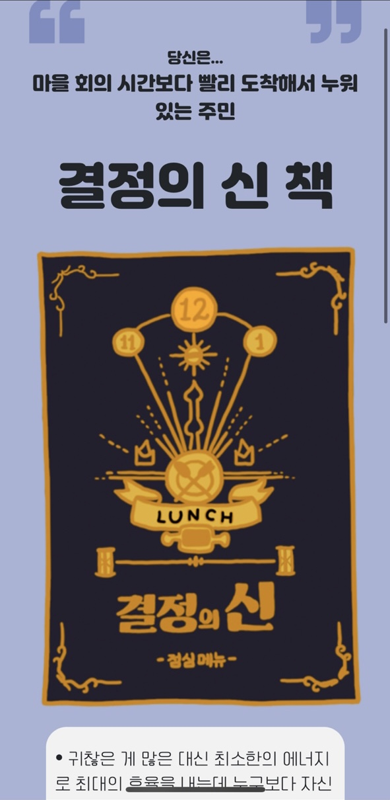
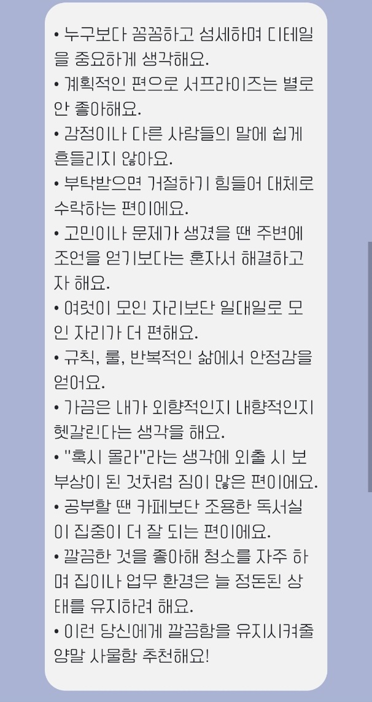

# 아이템 테스트 (itemTest)

"나에게 어울리는 쓸모없는 선물은?"을 컨셉으로 한 MBTI 테스트 웹

## 📝 소개

- 딱딱한 질문 대신 "낯선 마을로 이사 와 환영회에 참석하는 상황"을 가정한 스토리텔링형 MBTI 테스트
- 총 12개 질문에 답하면 16가지 유형 중 나에게 어울리는 "쓸모없는 선물" 결과 제공
- 결과별 공유 페이지 및 카카오톡 공유 기능 제공

## ✨ 주요 기능

- 2지선다 질문 12개 → 유형별 점수 누적 → 결과 산출
- 결과 이미지 / 설명 / 궁합 좋은·나쁜 유형 표시
- 카카오톡 공유하기 (결과별 고유 URL)
- Google Analytics 연동

## 📸 서비스 화면

<!-- 이미지 추가:  -->
<!-- 이미지 추가:  -->

## 🛠 기술 스택

- HTML, CSS, JavaScript (Vanilla JS)
- Bootstrap 5
- Kakao SDK, Google Analytics

## 📁 폴더 구조

```
├─index.html
├─css/
│  ├─default.css
│  ├─main.css
│  ├─qna.css
│  ├─animation.css
│  └─result.css
├─js/
│  ├─start.js   : 질문 진행, 점수 계산, 결과 표시 로직
│  ├─data.js    : 질문/답변/결과 데이터
│  └─share.js   : 카카오 공유 링크 생성
├─img/          : 메인 및 결과 이미지
└─page/         : 결과별 공유용 정적 페이지 (16종)
```

## 🗓 진행 기간

2021.10.01 ~ 2021.10.13

## 👥 팀 구성

프론트엔드 2인 프로젝트
